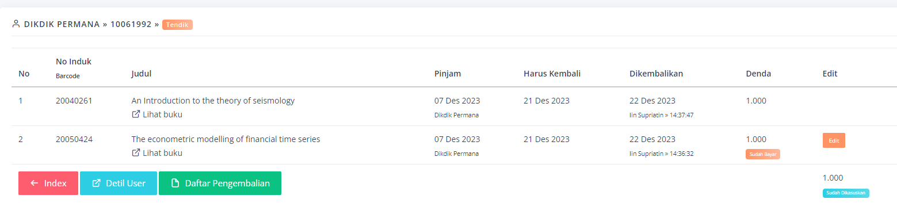

View Index

- Staf count done

- search return done

- Daftar Pengembalian search by nim/nip tanggal done

- laporan denda

*NOTE Jika ada total denda yang tidak sesuai, cek dulu lapaoran denda, siapa tau ada yang kasus*

-- 'finePayProvider' => NULL done

-- rekap

- Lihat history return done
```php
//function listAll()
$where['loan.returnedDate !='] = 'null';
//to
 $where['loan.returnedDate !='] = '0000-00-00';
```


- last return done

-- by staff done

-- by nim done

-- by tanggal done

- save done

-- modal pesan pinjam done

-- kirim email pesan pinjam done

- pembayaran denda done

-- update fine log done

-- update loan done

- edit denda yang sudah dibayar

-- update loan done

-- update log_loan_fine done

NOTE kalo edit, ga usah update fine log, biar ketauan awal dendanya. waloupun di log_loan_fine dimasukin semua

TEMUAN KASUS DOKUMENTASI ADA DI WA

-- jika 1 user ada beberapa buku yang denda, jika 1 diproses kasuskan. kemudian jika ada buku yg menyusul dikembalikan. maka hasilnya seperti ini tombol bayar atau kasuskan tidak ada

-- ini juga klo sudah dikasuskan semua list, total denda jadi 0 (by where), jadi status dibawah ga mauncul


```php
//v retur
if (session('ownerActiveFine')) :
    if ($totalDenda > 0) :
        if (!in_array($user->userAccount, $userInCase)) :
            $strLoanID = substr($loanIDS, 0, -1);
        endif;
    endif;
endif;
```

- kasuskan denda done

-- update fine log done

-- update loan done

-- update user_case done

-- update frs dan wisuda json

*CATATAN*
```php
function returLast()
{
    $staffID = $this->uri->segment(3);
    if ($staffID == '') {
        $staffID = $this->staffID;
    }

    $where = array(
        'loan.returnedDate' => $this->today,
        'loan.staffReturn' => $staffID,
        'loan.ownerID' => $this->ownerID
    );
    $this->db->order_by('returnedDate DESC, returnedTime DESC');
    $this->db->limit(1);
    $getUserAccount = $this->db->get_where('loan', $where);
    redirect($this->base_ctrl . '/index/' . $getUserAccount->row()->userAccount);
}

//controller index
if ($userAccount == '') {
    $where = array(
        'loan.returnedDate' => $this->today,
        'loan.staffReturn' => $this->staffID,
        'loan.ownerID' => $this->ownerID
    );
    $this->db->order_by('returnedDate DESC, returnedTime DESC');
    $this->db->limit(1);
    $getUserAccount = $this->db->get_where('loan', $where); //get last user      

    $input = 'Nomor Induk/Barcode';
} else {

    $where = array(
        'loan.returnedDate' => $today,
        'loan.ownerID' => $this->ownerID
    );
    $getUserAccount = $this->db->get_where('user_account', array('userAccount' => $userAccount));  //get user custom

    $input = 'NIM/NIP/Nopeg';
}

//initnya ada disini
if ($getUserAccount->num_rows()) {
    $userAccount = $getUserAccount->row()->userAccount;
}
//soalnya link pasti return/index/nim
//walopun stafID di lastReturn redirect ke return/index/nim
```

POST diusahakan redirect
GET return view juga ok